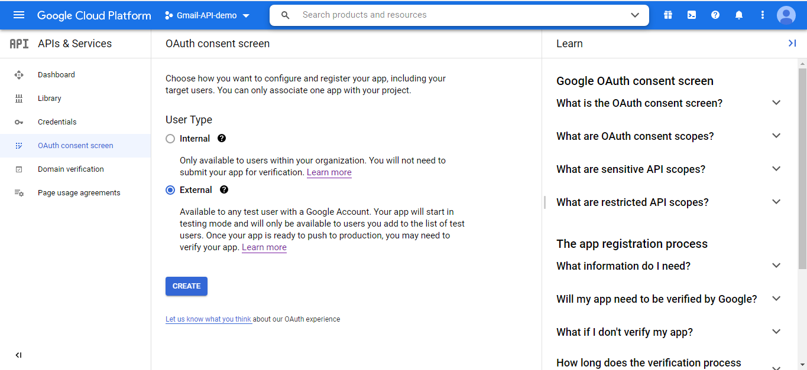

[![Contributors][contributors-shield]][contributors-url]
[![Forks][forks-shield]][forks-url]
[![Stargazers][stars-shield]][stars-url]
[![Issues][issues-shield]][issues-url]


<!-- PROJECT LOGO -->
<br />
<p align="center">
  <a href="https://github.com/lethaiviet/GmailAPI">
    
  </a>

<h3 align="center">Gmail API demo with java</h3>

<!-- TABLE OF CONTENTS -->
<details open="open">
  <summary>Table of Contents</summary>
  <ol>
    <li><a href="#about-the-project">About The Project</a></li>
    <li>
      <a href="#getting-started">Getting Started</a>
      <ul>
        <li><a href="#prerequisites">Prerequisites</a></li>
        <li><a href="#installation">Installation</a></li>
      </ul>
    </li>
    <li><a href="#usage">Usage</a></li>
    <li><a href="#contact">Contact</a></li>
  </ol>
</details>


<!-- ABOUT THE PROJECT -->

## About The Project

This is only a small demo about how to use Gmail api:

* Send a message with the body is plain text or html
* Send a message with attachment
* Get the emails with query
* Get the link directly from the content email

<!-- GETTING STARTED -->

## Getting Started

### Prerequisites

* [Git](https://git-scm.com/downloads)
* [IntelliJ IDEA](https://www.jetbrains.com/idea/download/#section=windows)
* [Lombok Plugin on IntelliJ IDEA](https://projectlombok.org/setup/intellij)
* [An account gmail](https://accounts.google.com/SignUp?hl=en)

### Installation

1. Clone the repo

   ```sh
   git clone https://github.com/lethaiviet/GmailAPI.git
   ```

2. Create `client_secret.json` for your account gmail

[comment]: <> (https://www.tablesgenerator.com/html_tables#)
<details><summary>More details</summary>
<table class="tg">
<tbody>
  <tr>
    <td class="tg-0pky" width="200">Description</td>
    <td class="tg-0pky">Steps</td>
    <td class="tg-0pky">Image</td>
  </tr>
  <tr>
    <td class="tg-0pky" rowspan="3">In order to use Google APIs, we must create first the project on Google developer console</td>
    <td class="tg-0pky">1.Open <a href="https://console.cloud.google.com/">the Google Cloud Console</a></td>
    <td class="tg-0pky"></td>
  </tr>
  <tr>
    <td class="tg-0pky">2.Click to "CREATE PROJECT" > fill all information as the image</td>
    <td class="tg-0pky"></td>
  </tr>
  <tr>
    <td class="tg-0pky">3.Click to the CREATE button > we have the results as the image</td>
    <td class="tg-0pky"></td>
  </tr>

  <tr>
    <td class="tg-0pky" rowspan="4">When you use OAuth 2.0 for authorization, your app requests authorizations for one or more scopes of access from a Google Account. Google displays a consent screen to the user including a summary of your project and its policies and the requested scopes of access. You must configure the consent screen for all apps</td>
    <td class="tg-0pky">4.Click APIs & Services > Credentials</td>
    <td class="tg-0pky"></td>
  </tr>
  <tr>
    <td class="tg-0pky">5.Click "OAuth consent screen"</td>
    <td class="tg-0pky"></td>
  </tr>
  <tr>
    <td class="tg-0pky">6.Click the user type for your app > select "External"</td>
    <td class="tg-0pky"></td>
  </tr>
  <tr>
    <td class="tg-0pky">7.Click Create > fill out the form</td>
    <td class="tg-0pky"><br>
<br>
<br>
</td>
  </tr>

  <tr>
    <td class="tg-0pky" rowspan="3">In order to access any data, we need to create credentials. These credentials identify our project to google and are used by our application to authorize and authenticate a user via Oauth2</td>
    <td class="tg-0pky">8.Click to "Credentials" > Click to "Create Credentials"</td>
    <td class="tg-0pky"></td>
  </tr>
  <tr>
    <td class="tg-0pky">9.Fill out the form as the image</td>
    <td class="tg-0pky"></td>
  </tr>
  <tr>
    <td class="tg-0pky">10.Click to the CREATE button > Click icon download to get <b>client_secret.json</b> </td>
    <td class="tg-0pky"></td>
  </tr>

  <tr>
    <td class="tg-0pky" rowspan="1">In order to use gmail api, we need enable it</td>
    <td class="tg-0pky">8.Click to "Library" > Search "Gmail api" > click to "Enable"</td>
    <td class="tg-0pky"></td>
  </tr>
</tbody>
</table>
</details>
<!-- USAGE EXAMPLES -->

3. After you get a `client_secret.json` file, copy and replace the file target `src/main/resources/tokens/client_secret.json`
4. Auth manually to get the `StoredCredential` file
<details><summary>More details</summary>
In the first time run `GmailQuickstart.java`, the program will open the browser and navigate it to the UI of Gmail API Oauth2:
    
   [![UI-Oauth2-gmail-api][UI-Oauth2-gmail-api]](https://github.com/lethaiviet/GmailAPI/blob/main/doc/images/12_Oauth2_manually.png)
   
Select an account which was allowed to test (in the above step 9) > Click to "continue"
   
   [![UI-Oauth2-gmail-api-2][UI-Oauth2-gmail-api-2]](https://github.com/lethaiviet/GmailAPI/blob/main/doc/images/12_Oauth2_manually2.png)
   
Click to "Allow"
   
   [![UI-Oauth2-gmail-api-3][UI-Oauth2-gmail-api-3]](https://github.com/lethaiviet/GmailAPI/blob/main/doc/images/12_Oauth2_manually3.png)
   
Continue clicking "Allow" and if we auth successfully, there are message show as below
   
   [![UI-Oauth2-gmail-api-4][UI-Oauth2-gmail-api-4]](https://github.com/lethaiviet/GmailAPI/blob/main/doc/images/12_Oauth2_manually4.png)

We have a `StoredCredential` file in `src\main\resources\tokens`. It help it auth automatically for the next times.
</details>

## Usage

1. Send a message with the body is html
   ```java
        //test send email
        String to = "lethaiviet002@gmail.com";
        String from = "me";
        String subject = "[TEST] Send message";
        String timestamp = getCurrentTimestamp().toString();
        String bodyHtml = readFileAsString(EMAIL_TEMPLATE).replace("PARAM_TIMESTAMP", timestamp);
        MimeMessage message = GmailHelper.createEmail(to, from, subject, "hello yellowCat", bodyHtml);
        GmailHelper gmailHelper1 = new GmailHelper();
        gmailHelper1.sendMessage(message);
   ```
   [![content-email][content-email]](https://github.com/lethaiviet/GmailAPI/blob/main/doc/images/11_content_email.png)

2. Get the link directly from the content email
   ```java
        //test get mail and get link timestamp in it
        String query = String.format(QUERY_FORMAT, from, subject, timestamp);
        GmailHelper gmailHelper2 = new GmailHelper(query);
        String linkInEmail = gmailHelper2.executeQueryWithWaitingTime().getLinkInMsgWithQuery();
        System.out.println("linkInEmail: " + linkInEmail);
   ```
<!-- CONTACT -->

## Contact

Le Thai Viet - [lethaiviet92@gmail.com]()

Project Link: [https://github.com/lethaiviet/GmailAPI](https://github.com/lethaiviet/GmailAPI)

<!-- MARKDOWN LINKS & IMAGES -->
<!-- https://www.markdownguide.org/basic-syntax/#reference-style-links -->

[contributors-shield]: https://img.shields.io/github/contributors/lethaiviet/GmailAPI.svg?style=for-the-badge

[contributors-url]: https://github.com/lethaiviet/GmailAPI/graphs/contributors

[forks-shield]: https://img.shields.io/github/forks/lethaiviet/GmailAPI.svg?style=for-the-badge

[forks-url]: https://github.com/lethaiviet/GmailAPI/graphs/network/members

[stars-shield]: https://img.shields.io/github/stars/lethaiviet/GmailAPI.svg?style=for-the-badge

[stars-url]: https://github.com/lethaiviet/GmailAPI/graphs/stargazers

[issues-shield]: https://img.shields.io/github/issues/lethaiviet/GmailAPI.svg?style=for-the-badge

[issues-url]: https://github.com/lethaiviet/GmailAPI/graphs/issues

[license-shield]: https://img.shields.io/github/license/othneildrew/Best-README-Template.svg?style=for-the-badge

[license-url]:https://github.com/lethaiviet/GmailAPI/graphs/blob/master/LICENSE.txt

[linkedin-shield]: https://img.shields.io/badge/-LinkedIn-black.svg?style=for-the-badge&logo=linkedin&colorB=555

[content-email]: doc/images/11_content_email.png

[UI-Oauth2-gmail-api]: doc/images/12_Oauth2_manually.png
[UI-Oauth2-gmail-api-2]: doc/images/12_Oauth2_manually2.png
[UI-Oauth2-gmail-api-3]: doc/images/12_Oauth2_manually3.png
[UI-Oauth2-gmail-api-4]: doc/images/12_Oauth2_manually4.png